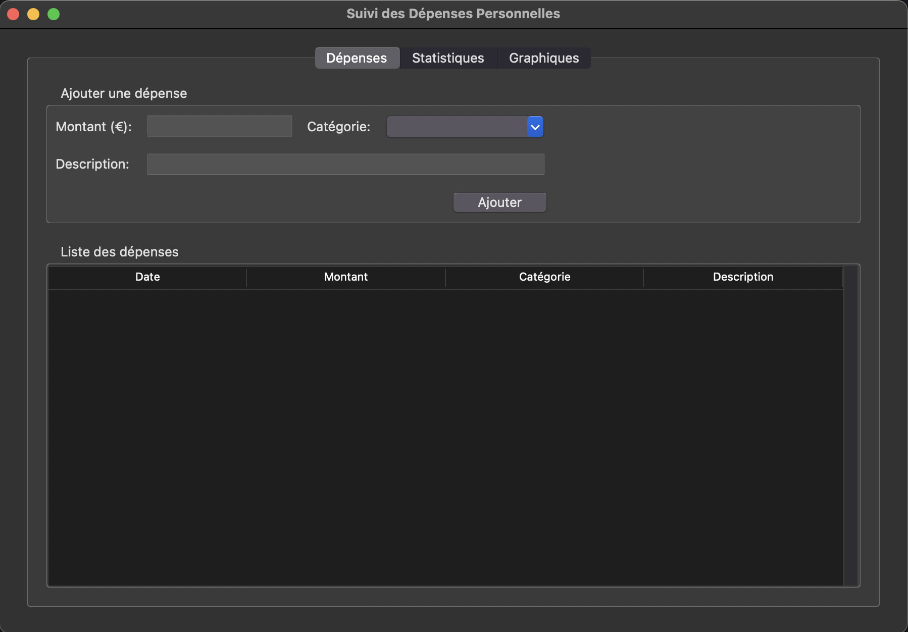
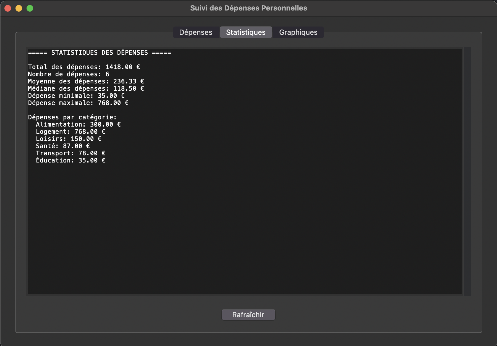
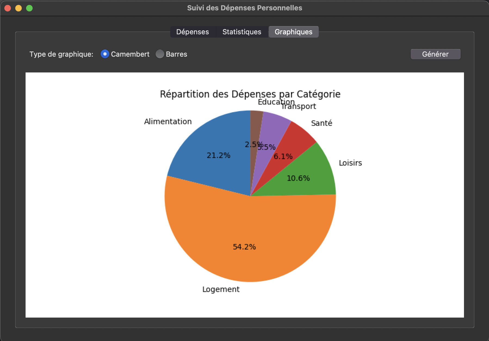
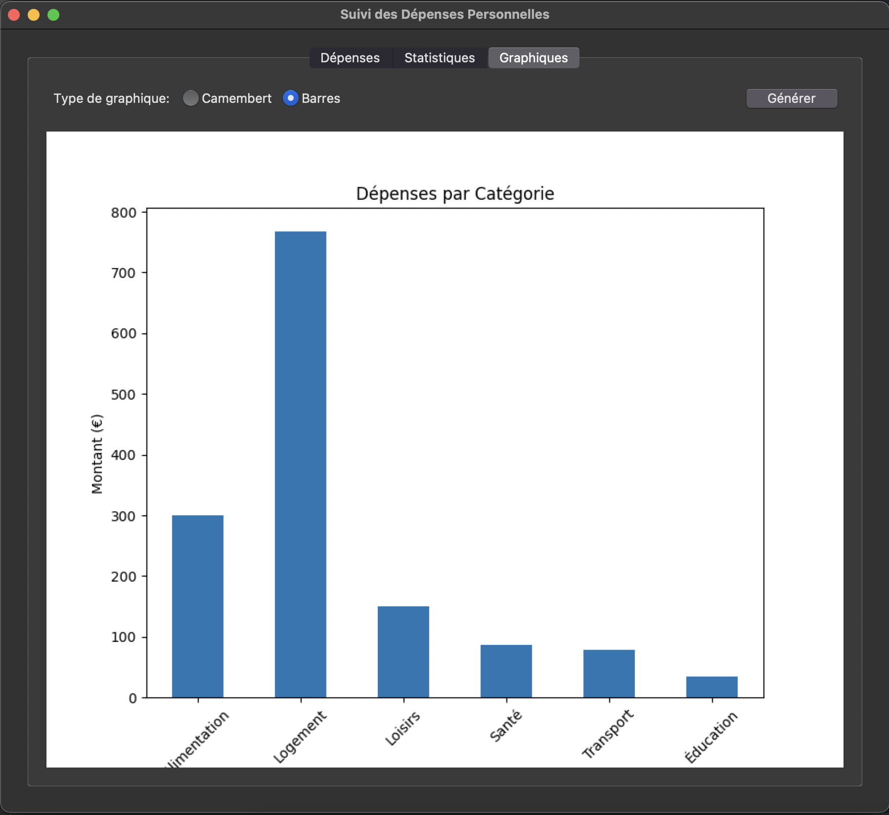

# Suivi des Dépenses Personnelles 💰

[](https://www.python.org/downloads/)
[]()
[]()

Application Python permettant de suivre et d'analyser vos dépenses mensuelles avec une interface graphique intuitive.

## 📋 Fonctionnalités

- Saisie des dépenses (montant, catégorie, description)
- Stockage des données en CSV
- Génération de statistiques détaillées
- Visualisation graphique des dépenses
- Génération de rapports PDF
- Interface graphique conviviale

## 📸 Captures d'écran

### Interface principale


*L'interface principale de l'application avec le formulaire d'ajout de dépenses et la liste des dépenses enregistrées.*

### Visualisation des statistiques


*Visualisation des statistiques détaillées de vos dépenses.*

### Graphiques


*Répartition de vos dépenses par catégorie sous forme de graphique en camembert.*


*Montant des dépenses par catégorie sous forme de graphique en barres.*

### Rapport PDF


*Exemple de rapport PDF généré par l'application.*

## 🔧 Prérequis

Pour utiliser cette application, vous devez avoir Python 3.6 ou supérieur installé, ainsi que les bibliothèques suivantes :

```
pandas
matplotlib
seaborn
reportlab
tkinter (inclus dans la plupart des installations Python)
```

Vous pouvez installer ces dépendances en utilisant pip :

```bash
pip install -r requirements.txt
```

## 📁 Structure du projet

```
.
├── main.py              # Point d'entrée de l'application
├── expense_manager.py   # Gestion des dépenses (ajout, stockage)
├── expense_analyzer.py  # Analyse et statistiques des dépenses
├── expense_reporter.py  # Génération de rapports PDF
├── gui.py               # Interface graphique utilisateur
├── data/                # Stockage des données (CSV)
├── reports/             # Rapports et graphiques générés
└── screenshots/         # Captures d'écran pour la documentation
```

## 🚀 Utilisation

1. Clonez ce dépôt :

```bash
git clone https://github.com/votre-utilisateur/suivi-depenses.git
cd suivi-depenses
```

2. Installez les dépendances :

```bash
pip install -r requirements.txt
```

3. Lancez l'application :

```bash
python main.py
```

4. Utilisez le menu pour :
   - Ajouter une nouvelle dépense
   - Afficher toutes les dépenses
   - Consulter les statistiques
   - Générer des graphiques
   - Créer un rapport PDF

## 📊 Exemples de graphiques générés

L'application génère automatiquement plusieurs types de graphiques pour visualiser vos dépenses :

- **Répartition des dépenses par catégorie** (camembert)
- **Montant des dépenses par catégorie** (barres)
- **Évolution des dépenses dans le temps** (ligne)

## 📄 Rapport PDF

Le rapport PDF généré inclut :
- Un résumé des statistiques générales
- La répartition des dépenses par catégorie
- Les graphiques d'analyse

## 🤝 Contribution

Les contributions sont les bienvenues ! N'hésitez pas à :

1. Fork le projet
2. Créer une branche pour votre fonctionnalité (`git checkout -b feature/nouvelle-fonctionnalite`)
3. Commit vos changements (`git commit -m 'Ajout d'une nouvelle fonctionnalité'`)
4. Push vers la branche (`git push origin feature/nouvelle-fonctionnalite`)
5. Ouvrir une Pull Request

## 📝 Licence

Ce projet est sous licence libre.

---

⭐ N'hésitez pas à mettre une étoile à ce projet si vous l'avez trouvé utile ! ⭐